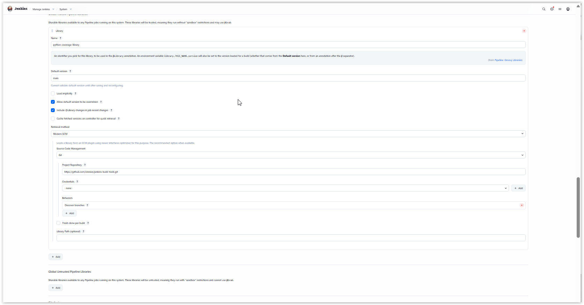

# Jenkins Build Tools Library

A set of shared pipeline functions and a Python utility for use by Jenkins build jobs, for use with
the Jenkins [Embeddable Build Status](https://plugins.jenkins.io/embeddable-build-status/) plugin.

<!-- START doctoc generated TOC please keep comment here to allow auto update -->

<!---toc start-->

* [Jenkins Build Tools Library](#jenkins-build-tools-library)
* [Requirements](#requirements)
* [Installation](#installation)
* [Provided functions](#provided-functions)
  * [reportCoveragePercent()](#reportcoveragepercent)
    * [Usage in a Jenkinsfile](#usage-in-a-jenkinsfile)
      * [Option A: Static Import (Recommended)](#option-a-static-import-recommended)
      * [Option B: Dynamic Loading](#option-b-dynamic-loading)
  * [reportCoverageLinePercent()](#reportcoveragelinepercent)
  * [reportCoverageBranchPercent()](#reportcoveragebranchpercent)
    * [Auxiliary utility methods](#auxiliary-utility-methods)
      * [createTempLocation()](#createtemplocation)
      * [copyGlobalLibraryScript()](#copygloballibraryscript)
      * [callAndReturnJson()](#callandreturnjson)

<!---toc end-->

<!-- END doctoc generated TOC please keep comment here to allow auto update -->


# Requirements

To parse the `pyproject.toml` file of a project, this library makes use of the
default Python 3 version found in the search path as `python3`, and needs the
following packages installed (follow the instructions on each of those pages to
install them):

- [tomli](https://pypi.org/project/tomli/) for Python versions less than 3.11 or
- [tomllib](https://docs.python.org/3/library/tomllib.html) for Python 3.11 and later

All other Python libraries used should be automatically installed for any
supported Python version.

It also requires the `xmllint` utility, which is available as a part of the
`libxml2` package on EL9 based systems, and similar packages on other distros.

# Installation

To install this library, as an administrator, go to **Manage Jenkins** -> **System** -> **Global Trusted Pipeline
Libraries** or **Manage Jenkins** -> **System** -> **Global Unrusted Pipeline Libraries**, and fill in the **Name**,
**Default version**, select 'Modern SCM' as the **Retrieval Method**, enter the repository URL in the **Project
Repository** field, and save. That is pretty much it. You can choose whether or not to load the library implicitly,
as well as selecting the other settings as you choose.

Here, you can see how it looks on my system:



# Provided functions

## reportCoveragePercent()

The `reportCoveragePercent()` method is designed to work with an embeddable build status badge produced
by the Jenkins [Embeddable Build Status](https://plugins.jenkins.io/embeddable-build-status/) plugin.
It is the core method of this library, taking the badge and an optional value of `line` or `branch` (defaulting to
`line`). From there, it reads the `coverage.xml` file produced by the Python
[coverage](https://coverage.readthedocs.io/) tool and makes the calls to set the status string and color of the
badge according to settings configured in the project's `pyproject.toml` file. The settings can be set using the
following block in the file (which shows the default values):

```toml
[tools.ReportCoverage]
coverage_file = "coverage.xml"
fail_under = 60
fail_color = "red"
warn_under = 80
warn_color = "orange"
pass_color = "green"
```

**NOTE**: Do not call this method or the others unless you have a `pyproject.toml` file, as while it will generate the
expected results without setting the values in the file, the failure to find the file or parse it is considered an
error.

### Usage in a Jenkinsfile

To use this method, or any of the others, you basically have two choices, based on the loading style desired. As all 
methods for this utility class are `static`, there is no need to instantiate the class, and you only need specify the 
class name and method.

#### Option A: Static Import (Recommended)

Use the `@Library` annotation followed by a standard Groovy import.

```jenkins
@Library('python-coverage-library')
import org.ka8zrt.ReportCoverage

def myCoverageBadge = addEmbeddableBadgeConfiguration(id: "myCoverageBadge", subject: "Line Coverage")

pipeline {
    agent any
    stages {
        stage('Example') {
            script {
                // Call static method directly.
                ReportCoverage.reportCoveragePercent(myCoverageBadge, "line")
            }
        }
    }
}
```

That is all there is to it.any

#### Option B: Dynamic Loading

If you load the library at runtime using the `library` step, you access static methods via the returned library object.

```jenkins
script {
    // Load library dynamically
    def myLib = library('python-coverage-library')
    
    // Initialize our custom badge with a unique ID
    def myCoverageBadge = addEmbeddableBadgeConfiguration(
        id: 'myCoverageBadge',
        subject: 'Line coverage'
    )

    try {
        myCoverageBadge.setStatus('running') // Update status at start
        // ... build steps ...
        myLib.org.ka8zrt.ReportCoverage.reportCoveragePercent(myCoverageBadge)
    } catch (Exception e) {
        myCoverageBadge.setStatus('failing')
        throw e
    }
}
```

## reportCoverageLinePercent()

This method is merely a wrapper for the `reportCoveragePercent()` method, which takes just the badge as an argument and
explicitly specifies the `line` metric. It is provided as a convenience method which guarantees that any future change
to `reportCoveragePercent()` will continue to work with line metrics.

## reportCoverageBranchPercent()

This method, like `reportCoverageLinePercent()`, is a wrapper for the `reportCoveragePercent()` method, but instead
explicitly specifies the `branch` metric.

### Auxiliary utility methods

The following methods are generic utility methods used by this library.

#### createTempLocation()

This method takes a string path parameter, and returns a temporary location for holding a script in the workspace for
execution.

#### copyGlobalLibraryScript()

This method takes a resource source path and an optional destination path, and returns the path to the file, copied
to its destination (by default, a temporary location), with permissions set so that the file is executable.

#### callAndReturnJson()

This method takes a script name and copies it from the resource library to a temporary location, executes it, and parses
the output as JSON to be returned as a Groovy map object.
